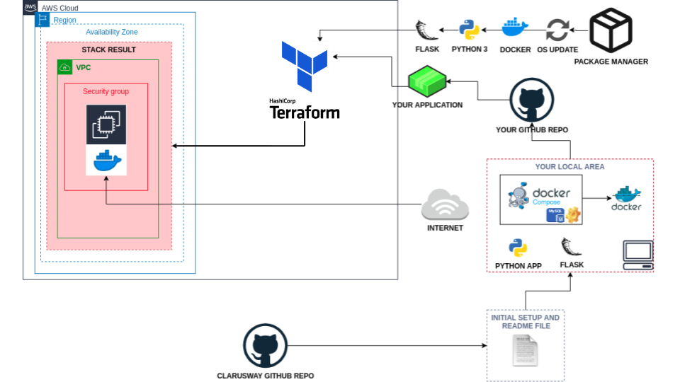
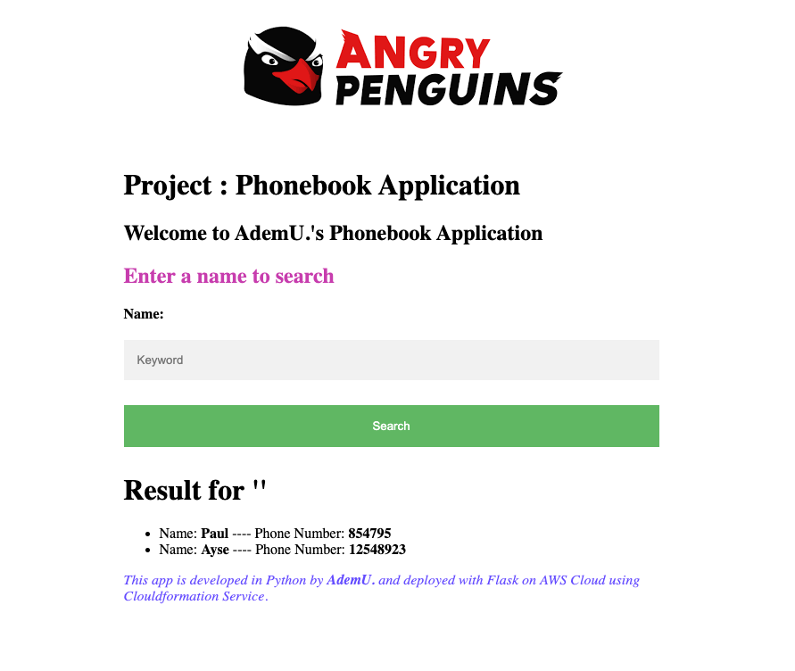

# Phonebook Application (Python Flask + MySQL + AWS SSM)

## Description
This is a simple **Phonebook Web Application** built with **Python Flask**. It supports full **CRUD** operations: Create, Read, Update, and Delete contacts. The application uses **MySQL** as its database and securely retrieves database credentials from **AWS Systems Manager Parameter Store (SSM)**.

Phonebook Application aims to create a phonebook web service using Docker to give students the understanding to dockerization of an application. The application code is to be deployed as a web service with Flask using Dockerfile and Docker Compose on AWS Elastic Compute Cloud (EC2) Instance using Terraform.

## Problem Statement



<br>

- Your company has recently started a project that aims to serve as phonebook web application. You and your colleagues have started to work on the project. Your teammates have developed the UI part the project as shown in the template folder and develop the coding part and they need your help to deploying the app in development environment.

- As a first step, you need to write program that creates a phonebook, adds requested contacts to the phonebook, finds and removes the contacts from the phonebook.

- Application should allow users to search, add, update and delete the phonebook records and the phonebook records should be kept in separate MySQL database in AWS RDS service. Following is the format of data to be kept in db.

  - id: unique identifier for the phone record, type is numeric.

  - person: full name of person for the phone record, type is string.

  - number: phone number of the person. type is numeric.

- All the interactions with user on phonebook app should be done in case insensitive manner and name of the person should be formatted so that, only the first letters of each words in the name of the person should be in capital letters. If the user inputs number in the username field, user should be warned with text message.

- Phone numbers in the app can be in any format, but the inputs should be checked to prevent string type. If the user inputs string in the number field, user should be warned with text message.

- Example for user inputs and respective formats

```text
Input in username field          Format to convert
--------------                   -----------------
''                               Warning -> 'Invalid input: Name can not be empty'
callahan                         Callahan
joHn doE                         John Doe
62267                            Warning -> 'Invalid input: Name of person should be text'

Input in number field            Format to convert
--------------                   -----------------
''                               Warning -> 'Invalid input: Phone number can not be empty'
1234567890                       1234567890
546347                           546347
thousand                         Warning -> 'Invalid input: Phone number should be in numeric format'
```

- As a second step, after you finish the coding, you are requested to deploy your web application using Python's Flask framework.

- You need to transform your program into web application using the `index.html`, `add-update.html` and `delete.html` within the `templates` folder. Note the followings for your web application.

  - User should face first with `index.html` when web app started and the user should be able to; 

    - search the phonebook using `index.html`.

    - add or update a record using `add-update.html`.

    - delete a record using `delete.html`.

  - User input can be either integer or string, thus the input should be checked for the followings,

    - The input for name should be string, and input for the phone number should be decimal number.

    - When adding, updating or deleting a record, inputs can not be empty.

    - If the input is not conforming with any conditions above, user should be warned using the `index.html` with template formatting.

<br><br>

<br><br>


- You are, as a cloud engineer, requested to deploy the app in the development environment on a Docker Machine on AWS EC2 Instance using Terraform to showcase your project. To do that you need to;

  - Get the app code from GitHub repo of your team.

  - Create docker image using the `Dockerfile`.

  - Deploy the app using `docker compose`. To do so;

    - Create a database service using MySQL.

    - Configure the app service to run on `port 80`.

    - Use a custom network for the services.

- In the development environment, you can configure your Terraform config file using the followings,

  - The application should be created with new AWS resources.

  - The application should run on Amazon Linux 2 EC2 Instance

  - EC2 Instance type can be configured as `t2.micro`.

  - Instance launched by Terraform should be tagged `Web Server of Bookstore`

  - The Web Application should be accessible via web browser from anywhere.

  - The Application files should be downloaded from Github repo and deployed on EC2 Instance using user data script within Terraform configuration file.

  - Bookstore Web API URL should be given as output byTerraform, after the resources created.


## Project Skeleton 

```text
dockerization-phonebook-on-python-flask-mysql (folder)
|
|----readme.md          # Given to the students (Definition of the project)
|----phonebook-app.py   # Given to the students (Python Flask WebApp)
├── templates/
│ ├── index.html # Search page
│ ├── add-update.html # Add/Update page
│ └── delete.html # Delete page
|----requirements.txt   # Given to the students (List of Flask modules for WebApp)
|----main.tf            # To be delivered by students (Terraform config file)
|----docker-compose.yml # To be delivered by students
|----Dockerfile         # To be delivered by students
|----cfn-template.yml   # To be delivered by students (Optional)

```


## AWS SSM Parameters

The application fetches the following parameters from AWS SSM:

| Parameter Name                    | Description                 |
|-----------------------------------|-----------------------------|
| `/baby/phonebook/username`        | Database username           |
| `/baby/phonebook/password`        | Database password (secure)  |
| `/baby/phonebook/dbname`          | Database name               |
| `/baby/phonebook/token`           | Github TOKEN                |


## Expected Outcome

### At the end of the project, following topics are to be covered;

- MySQL Database Configuration

- Bash scripting

- Docker Images

- Docker Compose

- AWS EC2 Service

- AWS Security Group Configuration

- AWS Cloudformation Service (Optional)

- Terraform Configuration with AWS

- Git & Github for Version Control System

### At the end of the project, students will be able to;

- configure connection to the `MySQL` database.

- build a Docker image.

- configure Docker Compose to run Python Flask app.

- improve bash scripting skills using `user data` section in Terraform to install and setup web application on EC2 Instance

- configure AWS EC2 Instance and Security Groups.

- configure Terraform files to use AWS Resources.

- use git commands (push, pull, commit, add etc.) and Github as Version Control System.

- run the web application on AWS EC2 instance using the GitHub repo as codebase.

## Steps to Solution
  
- Step 1: Download or clone project definition from `dockerization-phonebook-on-python-flask-mysql` repo on Github

- Step 2: Create project folder for local public repo on your pc

- Step 3: Prepare scripts to build a Python Flask App Image using Dockerfile and Docker Compose

- Step 4: Prepare a Terrform configuration file to deploy your app on EC2 Instance

- Step 5: Push your application into your own public repo on Github

- Step 6: Deploy your application on AWS Cloud using Terraform to showcase your app within your team.

## Notes

- Use the template formatting library jinja within Flask framework to leverage from given templates.

- Use given app and html templates to warn user with invalid inputs.

- Customize the application by hard-coding your name for the developer_name variable within html templates.